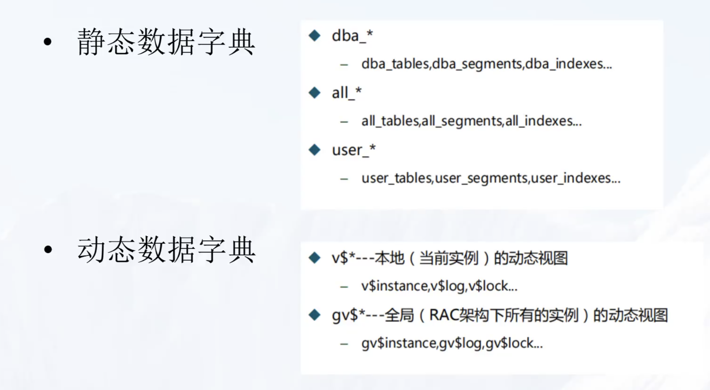
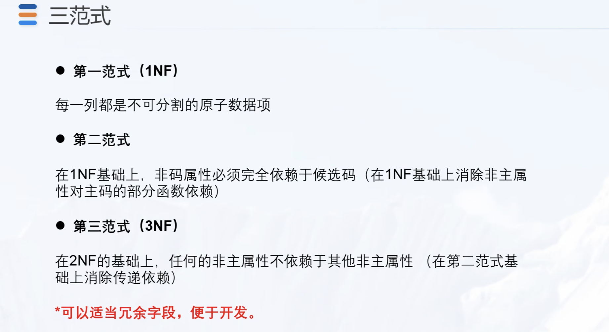
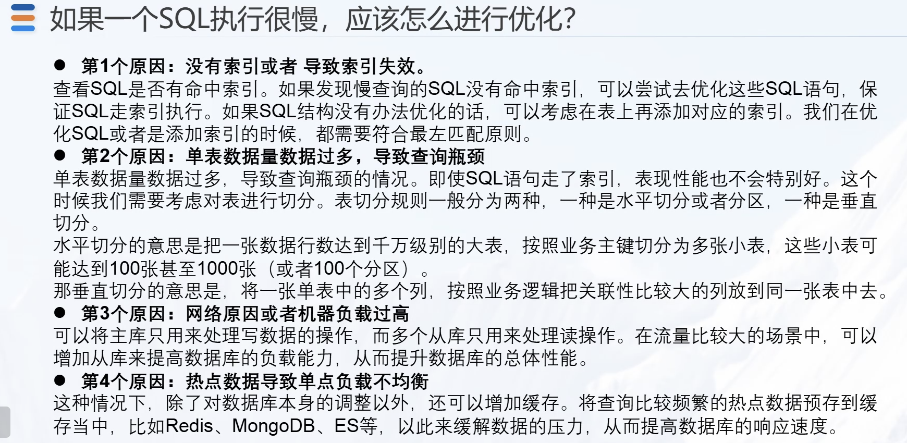

# 20220928

## 主题

* 时间：20220928 18:30-19:38

* 地点：腾讯会议

* 人员：建行内部中-〉高人员

* 主题：

  * 数据库基础知识

  * 数据库知识提升

  * SQL优化案例&其他

## 1 基础知识

* 表空间、文件、段
* 常见数据类型
  * CHAR VARCHAR2 number(int/float) DATE  TIMESTAMP  CLOB
* 数据库中对象
  * TABLE
  * INDEX
  * VIEW
  * MATERIALIZED VIEW 物化视图
  * SEQUENCE
  * FUNCTION
  * INDEX   PARTITION 
  * TABLE PARTITION
  * SCHEDULE   后台定时调度
  * PROCEDURE 存储过程
  * TRIGGER  触发器
  * PACKAGE 
  * DIRECTORY
  * DATABASE LINK

* 静态数据字典

* 动态数据字典

  

* 事务的属性ACID

  * 原子性
  * 一致性
  * 隔离性
  * 持久性

* 三范式

  

## 2 知识提升

* rowid: 插入记录时生成，rownum 查询时生成
* row标识的是行的物理地址  rownum标识查询的顺序

### 日期

* 月底
* 天数/月数计算

### 更新方式

* update
  * 更改单张表速度快稳定性好
* merge

### WITH语法

* sql可读性增强
* with子查询只执行一次

### 视图

* 也称虚表，不占用物理空间

### 索引

* B树索引（默认索引）
* 位图索引（更新锁定整表，OLAP使用）
* 函数索引
* 分区索引
* 全局索引
* 本地索引

### 行转列

* wm_concat (oracle 12g 不支持)
* LISTAGG
* Group by max
* unpivot

### 备份方式

* 导出insert语句
* create tables as 
* exp/imp
* expdp/impdp （服务器端操作，速度快，需要服务器权限）
* DBLink
* 表空间交换

### 正则表达式

* REGEXP_LIKE
* REGEXP_INSTR
* REGEXP_SUBSTR
* REGEXP_

### 死锁

* V$LOCKED_OBJECT 
*  V$SESSION 会话
* alter system kill session 'sid,xx'

### 分析函数

### 递归查询 connect by

### Oracle优化

* 索引
* 并行 
* 直接装载
* 分区
* 分区交换
* 压缩

### SQL慢，分析

### 闪回

### 执行计划

## 优化案例

* OLAP分层和功能
  * 贴源层
  * 基础层
  * 汇总层
  * 应用层
* 金融领域十大题
  * 重点设计主题
    * 客户/协议/事件
  * 自主设计主题
  * 简化设计主题