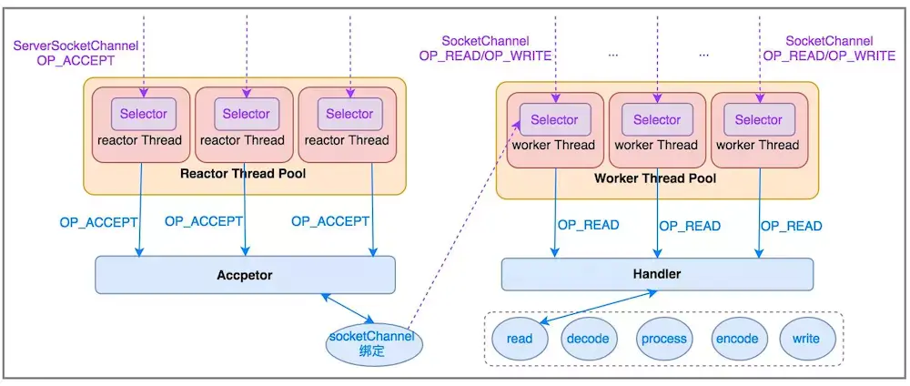
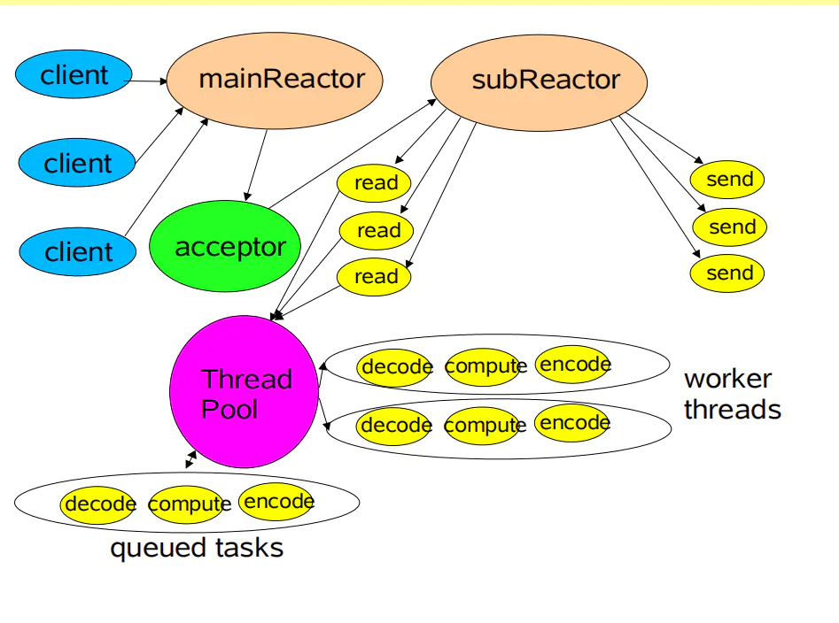

# Reactor模型

> create by nohi 20210817 
>
> 参考:https://www.jianshu.com/p/b2a0cf4a3ee6
>
> https://www.jianshu.com/p/344b3b03e6e1

一个连接里完整的网络处理过程一般分为accept、read、decode、process、encode、send这几个步骤

Reactor模型的核心结构

1. Reactor：响应器，负责响应事件
2. Handler：处理器，负责处理事件
3. Accepror：接收器，是事件处理器的一种，绑定了connect事件。当客户端发起connect操作时，Reactor会把connect事件，交给Acceptor处理。

Reactor模型

1. 单线程模型
2. 多线程模型
3. 主从多线程模型 （如下）

  

* 经典服务模式

## 单Reactor单线程模型

* 单线程Reactor模型编程简单，比较适用于每个请求都可以快速完成的场景，但是不能发挥出多核CPU的优势，在一般情况下，不会使用单Reactor单线程模型。

## 单Reactor多线程模型

## 主从Reactor模型

## Reactor模型结构图

* Synchronous Event Demultiplexer：同步事件分离器，用于监听各种事件，调用方调用监听方法的时候会被阻塞，直到有事件发生，才会返回。对于Linux来说，同步事件分离器指的就是IO多路复用模型，比如epoll，poll 等， 对于Java NIO来说， 同步事件分离器对应的组件就是selector，对应的阻塞方法就是select。

* Handler：本质上是文件描述符，是一个抽象的概念，可以简单的理解为一个一个事件，该事件可以来自于外部，比如客户端连接事件，客户端的写事件等等，也可以是内部的事件，比如操作系统产生的定时器事件等等。

* Event Handler：事件处理器，本质上是回调方法，当有事件发生后，框架会根据Handler调用对应的回调方法，在大多数情况下，是虚函数，需要用户自己实现接口，实现具体的方法。

* Concrete Event Handler： 具体的事件处理器，是Event Handler的具体实现。

* Initiation Dispatcher：初始分发器，实际上就是Reactor角色，提供了一系列方法，对Event Handler进行注册和移除；还会调用Synchronous Event Demultiplexer监听各种事件；当有事件发生后，还要调用对应的Event Handler。
