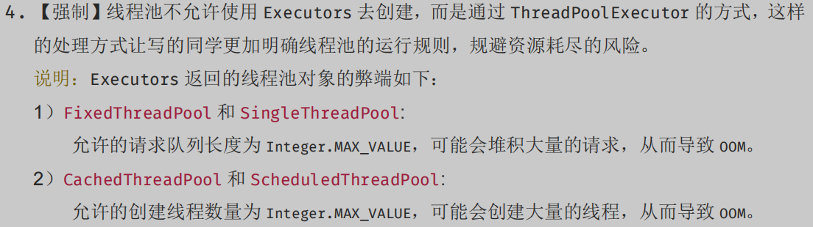

# Thread

> create by nohi 20221012

## 创建线程的几种方式

* 继承Thread类创建线程类

* 通过Runnable接口创建线程类

* 通过Callable和Future创建线程

  Runnable接口中的run()方法的返回值是void，它做的事情只是纯粹地去执行run()方法中的代码而已；
  Callable接口中的call()方法是有返回值的，是一个泛型，和Future、FutureTask配合可以用来获取异步执行的结果。

## 样例

> 参见：SpringCloud2022/nohi-web/src/test/java/nohi/_java/_thread/TestThreadPool.java

* Thread、Runnable

  ```
   // lambda表达式
   Runnable runnable1 = () -> {
     System.out.println("lambda Runnable");
   };
   new Thread(runnable1).start();
  ```

* Callable

  ```
   Callable<Integer> callable = new Callable<Integer>() {
     @Override
     public Integer call() throws Exception {
       Thread.sleep(6000);
       return new Random().nextInt();
     }
   };
   FutureTask<Integer> future = new FutureTask<>(callable);
   new Thread(future).start();
  ```

## 线程池

> 参考：https://zhuanlan.zhihu.com/p/65556060
>
> /nohi-web/src/test/java/nohi/_java/_thread/TestExecutors.java
>
> :warning: 不建议使用Executors



### Executors

```
/* 该方法返回一个固定线程数量的线程池，该线程池池中的线程数量始终不变。
 * 当有一个新的任务提交时，线程池中若有空闲线程，则立即执行。
 * 若没有，则新的任务会被暂存在一个任务队列中，待有线程空闲时，便处理在任务队列中的任务 
 * 默认等待队列长度为Integer.MAX_VALUE
 */
ExecutorService fixedThreadPool = Executors.newFixedThreadPool(1);
/* 该方法返回一个只有一个线程的线程池。
 * 若多余一个任务被提交到线程池，任务会被保存在一个任务队列中，等待线程空闲，按先入先出顺序执行队列中的任务
 * 默认等待队列长度为Integer.MAX_VALUE
 */
ExecutorService singleThreadExecutor = Executors.newSingleThreadExecutor();
/* 
 * 该方法返回一个可根据实际情况调整线程数量的线程池。
 * 线程池的线程数量不确定，但若有空闲线程可以复用，则会优先使用可复用的线程。
 * 若所有线程均在工作，又有新任务的提交，则会创建新的线程处理任务。
 * 所有线程在当前任务执行完毕后，将返回线程池进行复用
 */
ExecutorService newCachedThreadPool = Executors.newCachedThreadPool();
/* 该方法返回一个ScheduledExecutorService对象，线程池大小为1。
 * ScheduledExecutorService接口在ExecutorService接口之上扩展了在给定时间内执行某任务的功能，
 * 如在某个固定的延时之后执行，或者周期性执行某个任务
 */
ExecutorService newSingleThreadScheduledExecutor = Executors.newSingleThreadScheduledExecutor();
/*
 * 该方法也返回一个ScheduledExecutorService对象，但该线程池可以指定线程数量
 */
ExecutorService newScheduledThreadPool = Executors.newScheduledThreadPool(1);
```

以上的工具类的具体实现都是基于ThreadPoolExecutor类，处理策略都是AbortPolicy（直接抛出异常，阻止系统正常工作）

Executors 返回的线程池对象的弊端如下：

1） FixedThreadPool 、SingleThreadPool:

​	  允许的请求队列长度为 Integer.MAX_VALUE，可能会堆积大量的请求，从而导致 OOM。

2） CachedThreadPool 、 ScheduledThreadPool、SingleThreadScheduledExecutor:

​	  允许的创建线程数量为 Integer.MAX_VALUE， 可能会创建大量的线程，从而导致 OOM。

通常情况下，线程池不允许使用 Executors 去创建，而是通过 ThreadPoolExecutor 的方式，这样的处理方式让写的同学更加明确线程池的运行规则，规避资源耗尽的风险。

### ThreadPoolExecutor

> nohi-web/src/test/java/nohi/_java/_thread/TestThreadPoolExecutor.java

```
// ThreadPoolExecutor的全参构造方法
public ThreadPoolExecutor(int corePoolSize,int maximumPoolSize,long keepAliveTime, TimeUnit unit,
 BlockingQueue<Runnable> workQueue,ThreadFactory threadFactory,RejectedExecutionHandler handler) 
{
        if (corePoolSize < 0 ||
            maximumPoolSize <= 0 ||
            maximumPoolSize < corePoolSize ||
            keepAliveTime < 0)
            throw new IllegalArgumentException();
        if (workQueue == null || threadFactory == null || handler == null)
            throw new NullPointerException();
        this.corePoolSize = corePoolSize;
        this.maximumPoolSize = maximumPoolSize;
        this.workQueue = workQueue;
        this.keepAliveTime = unit.toNanos(keepAliveTime);
        this.threadFactory = threadFactory;
        this.handler = handler;
}
```

* corePoolSize 表示 核心线程数
        1. 创建线程池时, 在线程池中常驻的线程, 当corePoolSize <= 0 销毁线程池
        2. 当corePoolSize > 0 线程池中常驻的线程数 = corePoolSize.
        3. corePoolSize选择: 应该根据实际情况选择 , 如果corePoolSize 太小会存在频繁创建线程和销毁线程的行为

* maximumPoolSize表示 线程池最大线程数    

  1. 该数值必须在满足corePoolSize条件的情况下 大于当corePoolSize的数值    

  2. 当提交的线程数大于corePoolSize时 , 那么线程池就会创建新的线程 
  3. 这个线程的数量一定是在 corePoolSize <=线程数<= maximumPoolSize

*  keepAliveTime 表示空闲的线程存活时间      

    当线程池中的线程空闲时间大于 keepAliveTime时,    那么就会销毁多余的线程 , 到等于corePoolSize的 数值

    TimeUnit 表示线程存活的时间单位

* workQueue 线程任务队列 
      1. 当线程池中的所有任务队列都在执行任务时,那么新的线程任务就会存入到队列中 ,  等待被消费

* threadFactory 创建线程的工厂
  一般使用默认..Executors.defaultThreadFactory()

* handler 表示线程池的拒绝策略
  当线程池中的线程数 = maximumPoolSize , workQueue = Integer.MAX_VALUE时

  1. AbortPolicy：直接抛出异常，阻止系统正常工作。
  2. CallerRunsPolicy：只要线程未关闭，该策略直接在调用者线程中，运行当前被丢弃的任务。
  3. DiscardOldestPolicy：该策略将丢弃最老的一个请求，也就是即将被执行的一个人任务，并尝试再次提交当前任务。
  4. DiscardPolicy：该策略默默的丢弃无法处理对
  5. 当然也可以根据应用场景需要来实现RejectedExecutionHandler接口自定义策略。

* DEMO

  ```
  ThreadPoolExecutor executor = new ThreadPoolExecutor(
                  10 ,
                  20 ,
                  60,
                  TimeUnit.SECONDS,
                  new ArrayBlockingQueue<Runnable>(10),  // 指定队列大小
                  Executors.defaultThreadFactory(),
                  new ThreadPoolExecutor.AbortPolicy()
  );
  ```

  

