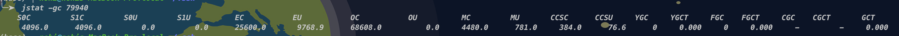

# 08 堆

## 1 堆的核心概述

* jvm启动时创建
* 一个jvm实例对应一个堆
* 堆物理上不连续，逻辑上连续
* 几乎所有对象都在堆上分配
* 数组、对象永不会存储在栈上，栈帧只存引用变量地址


## 2 设置堆内存大小与OOM

* jdk7及之前： 新生代+老年代+永久区 （PermSize)

  ```
  -Xms10M -Xmx20M -XPermSize
  ```

* jdk8及之后：新生代+老年代+元空间  (MetaSpaceSize)

  ```
  -Xms10M -Xmx20M -XMetaspaceSize1024m
  ```

* 默认大小
  * 初始大小：物理电脑内存 1/64
  * 最大内存：物理电脑内存 1/4

* DEMO：

  * ```
    -Xms100m -Xmx110m -XX:+PrintGCDetails
     // 初始大小
     long initialMemory = Runtime.getRuntime().totalMemory() / 1024/1024;
     // 最大
     long maxMemory = Runtime.getRuntime().maxMemory() / 1024/1024;
     System.out.println("-Xms:" + initialMemory + "M");
     System.out.println("-Xmx:" + maxMemory + "M");
    ```

  * 结果

    ```
    -Xms:96M
    -Xmx:98M
    Heap
     PSYoungGen      total 29696K, used 9768K [0x00000007bdb80000, 0x00000007bfc80000, 0x00000007c0000000)
      eden space 25600K, 38% used [0x00000007bdb80000,0x00000007be50a388,0x00000007bf480000)
      from space 4096K, 0% used [0x00000007bf880000,0x00000007bf880000,0x00000007bfc80000)
      to   space 4096K, 0% used [0x00000007bf480000,0x00000007bf480000,0x00000007bf880000)
     ParOldGen       total 68608K, used 0K [0x00000007b9200000, 0x00000007bd500000, 0x00000007bdb80000)
      object space 68608K, 0% used [0x00000007b9200000,0x00000007b9200000,0x00000007bd500000)
     Metaspace       used 5059K, capacity 5328K, committed 5504K, reserved 1056768K
      class space    used 594K, capacity 627K, committed 640K, reserved 1048576K
    ```

    Gc

    

​			  设置值：100m = S0C+S1C+EC+OC = 4096 + 4096 + 25600 + 68608 = 102400 = 100m

​			  -Xms:96M=S0C/S1c + EC + OC = 4096 + 25600 + 68608 = 98304 = 96M

* Virsualvm 插件：Visual GC 可显示GC情况


## 3 年轻代与老年代

* Eden  Survivor0  Survivor1

  * Eden 新创建对象

  * 比例：默认 -XX:SurvivorRatio=8   8:1:1 

    ```
    不通过参数设置，并不满足8:1:1
    ```

* 新生代/老年代比例

  默认：-XX:NewRatio=2 新生代占1，老年代占2，即新生代点堆1/3 

* -Xmn 设置新生代空间大小
* -XX:MaxTenuringThreshold=15 回收15次后如果还存活，晋升老年代


## 4 图解对象分配过程

Edgn区为 近直角三角形  S0/S1 为 间隔梯形   老年区 阶梯形

## 5 MinorGC MajorGC  FullGC

* 并非每次三个区域同时回收，大部分回收是新生代
* 新生代回收： Minor GC /  Young GC
* 老年代回收： Major GC /  Old GC
  * 只有GMS GC 会单独收集老年代
  * 很多时候 Major GC 和 Full GC混淆使用
* 混合回收：Mixed GC, 回收整个新生代及部分老年代
  * 目前只有G1 GC存在
* 整堆回收： Full GC, 回收整个堆及方法区


### 触发机制

* 年轻代  Minor GC

  * Eden区空间不足时触发， Survivro不会触发GC
  * 非常频繁，但回收速度快
  * 会引发STW

* 老年代 Major GC/Full GC

  * 出现之前，经常出现一次MinorGC （但Parallel 收器不会，期直接进行Major GC）
  * MajorGC速度一般比MinorGC慢10位以上，STW时间更长
  * Major之前内存仍不足，OOM

* Full GC触发：

  * System.gc()，建议系统执行Full GC,但不必然执行
  * 老年代空间不足
  * 方法空间不足
  * 通过MinorGC进入老年代大小，大于老年代可用内存

  **应尽量避免出现FullGC**

## 6 堆空间分代思想

* 不同对象生命周期不一样，70-99% 对象是临时对象
* 优化GC性能

## 7 内存分配策略

* 优先分配Eden

* 大对象直接分配到老年代

* 长期存活的对象分配到老年代

* 动态对象年龄判断

  * Survivor相同年龄对象的内存总和大于Survivor空间一半，年龄大于等于此年龄对象直接进入老年代，无需等到MaxTenuringThreshold中要求的年龄

* DEMO直接分配对象到老年区

  ```
  /**
  * 对象直接分配至老年代
  * -Xms60m -Xmx60m -XX:NewRatio=2 -XX:+PrintGCDetails -XX:SurvivorRatio=8
  *   Eden S0 S1 OLD
  *    16   2  2  40
  */
  public static void main(String[] args) {
  	// 20M
  	byte[] bytes = new byte[20 * 1024 * 1024];
  	// Byte会出现Gc OOM 为啥？
  	//Byte[] bytes = new Byte[20 * 1024 * 1024];
  }
  ```

  ```
  Heap
   PSYoungGen      total 18432K, used 2299K [0x00000007bec00000, 0x00000007c0000000, 0x00000007c0000000)
    eden space 16384K, 14% used [0x00000007bec00000,0x00000007bee3ee60,0x00000007bfc00000)
    from space 2048K, 0% used [0x00000007bfe00000,0x00000007bfe00000,0x00000007c0000000)
    to   space 2048K, 0% used [0x00000007bfc00000,0x00000007bfc00000,0x00000007bfe00000)
   ParOldGen       total 40960K, used 20480K [0x00000007bc400000, 0x00000007bec00000, 0x00000007bec00000)
    object space 40960K, 50% used [0x00000007bc400000,0x00000007bd800010,0x00000007bec00000)
   Metaspace       used 3133K, capacity 4496K, committed 4864K, reserved 1056768K
    class space    used 345K, capacity 388K, committed 512K, reserved 1048576K
  ```

## 8 为对象分配内存：TLB

## 9 小结堆空间的参数设置

* -Xms60m -Xmx60m -XX:NewRatio=2 -XX:+PrintGCDetails -XX:SurvivorRatio=8
* -XX:+PrintFlagsInitial 查看所有参数默认初始值
* -XX:+PrintFlagsFinal 查看所有参数最终值
* -XX:+PrintGC 简化版GC信息

## X 堆是分配对象的唯一选择吗？

* 逃逸分析

  * jdk1.7后特性 
  * -XX:-DoEscapeAnalysis (-关闭 + 开启)
  * 一个对象没有逃逸出方法的话，可能被优化成栈上分配

* TaoBaoVM: GCIH(GC invisible heap)

  * 生命周期较长的Java对象，移至堆外
  * gc不管理GCIH内部对象

* 结论：

  * 能使用局部变量的，就不要在方法定义

* 优化

  * 栈上分配 

    ```java
    package nohi.jvm._08_heap;
    
    import java.util.concurrent.TimeUnit;
    
    /**
     * <h3>thinkinjava</h3>
     *
     * @author NOHI
     * @description <p>演示逃逸分析、栈上分配</p>
     * @date 2022/11/12 23:05
     **/
    public class StackAllocation {
        /**
         * 演示逃逸分析、栈上分配
         * 1. 分配足够大内存，不开启逃逸分析： 不产生GC，查看内存使用
         *    -Xms1G -Xmx1G -XX:-DoEscapeAnalysis -XX:NewRatio=2 -XX:+PrintGCDetails -XX:SurvivorRatio=8
         * 2. 分配足够大内存，开启逃逸分析： 不产生GC，查看内存使用
         *   -Xms1-Xms100m -Xmx100m -XX:+DoEscapeAnalysis -XX:NewRatio=2 -XX:+PrintGCDetails -XX:SurvivorRatio=8G -Xmx1G -XX:+DoEscapeAnalysis -XX:NewRatio=2 -XX:+PrintGCDetails -XX:SurvivorRatio=8
         * 3. 分配100m内存，不使用逃逸分析，产品GC
         *    -Xms100m -Xmx100m -XX:-DoEscapeAnalysis -XX:NewRatio=2 -XX:+PrintGCDetails -XX:SurvivorRatio=8
         * 4. 分配100内存，开启逃逸分析，不产生GC
         * @param args
         */
        public static void main(String[] args) throws InterruptedException {
            StackAllocation s = new StackAllocation();
            long start = System.currentTimeMillis();
            for (int i = 0; i < 10000000; i++) {
                s.createUser();
            }
            System.out.println("耗时:" + (System.currentTimeMillis() - start));
    
            TimeUnit.MINUTES.sleep(5);
        }
    
        public void createUser(){
            Test t = new Test();
        }
        class Test{
        }
    }
    ```

    

  * 同步分配

    * 如果一个对象被发现只能从一个线程被访问到，那么对这个对象的操作可以不考虑同步

    * 同步代价高，降低并发性和性能

    * 优化：同步省略/锁消除

      ```java
      public void f(){
        Object hollis = new Object();
        synchronized (hollis) {
          .....
        }
      }
      ```

      ```java
      public void f(){
        Object hollis = new Object();
        //synchronized (hollis) {
          .....
        //}
      }
      ```

      

  * 标题替换

    * 标量：无法再分解成更小的数据的数据。
    * 正对而言的为聚合量，可以再分解
    * -XX:+EliminateAllocations （默认打开）

