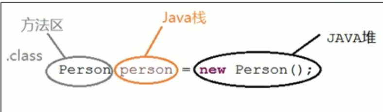

# 09方法区

* 栈、堆、方法区的交互关系

* 方法区的理解

* 设置方法区的大小与OOM

* 方法区的内部结构

* 方法区使用举例

* 方法区的演变过程
* 方法区的垃圾回收
* 总结

## 1 栈、堆、方法区的交互关系

## 2 方法区的理解

* 独立于堆的空间，非堆 
* 线程共享
* 方法区大小决定了系统可以保存多少个类，定义类太多可能导致 OOM Metaspace(JDK8  PermGen space JDK7)
* JDK7 之前称为永久代  JDK8元空间
* 元空间不在虚拟机内存，而使用本地内存

## 3设置方法区的大小与OOM

* JDK7及之前
  * -XX：PermSize 初始大小 默认20.75M
  * -XX:MaxPermSize 最大大小，32位机器默认64M, 64位机器82M
  * 异常：OutofMemeoryError Perm Size
* JDK8及之后
  * -XX:MetaspaceSize=512m  windows默认21m
  * -XX:MaxMetaspaceSize  默认-1，即没有限制

## 4 方法区的内部结构

* 类型信息、常量、静态变量、即时编译器编译后的代码缓存
* 常量池（字节码）
  * 常量值
  * 字符串值
  * 类引用
  * 字段引用
  * 方法引用
* 运行时常量池（方法区）

## 5 方法区使用举例

## 6 方法区的演变过程

* Hot Spot 存在永久代，共享堆，JRocket J9 不存在永久代存在元空间
* Oracle 收购 Bea后，JDK8移出永久代，改用元空间
* 永久代信息大小相对固定
* 永久代垃圾回收困难

## 7 方法区的垃圾回收

* 常量池中废弃的常量
* 不再使用的类型（条件较苛刻，费力不讨好）

## 8 总结