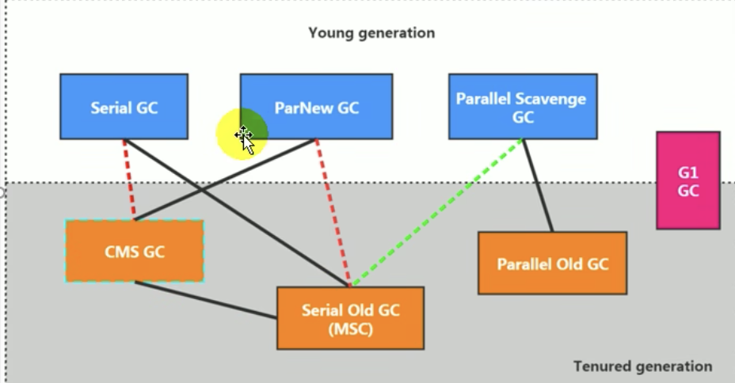
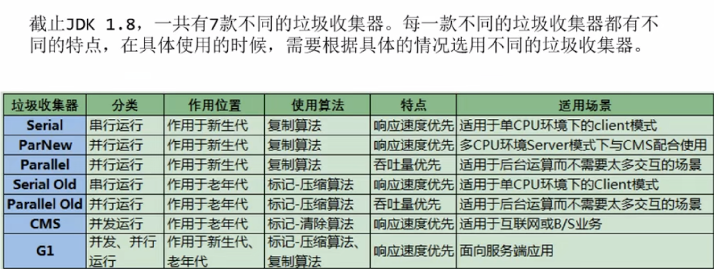
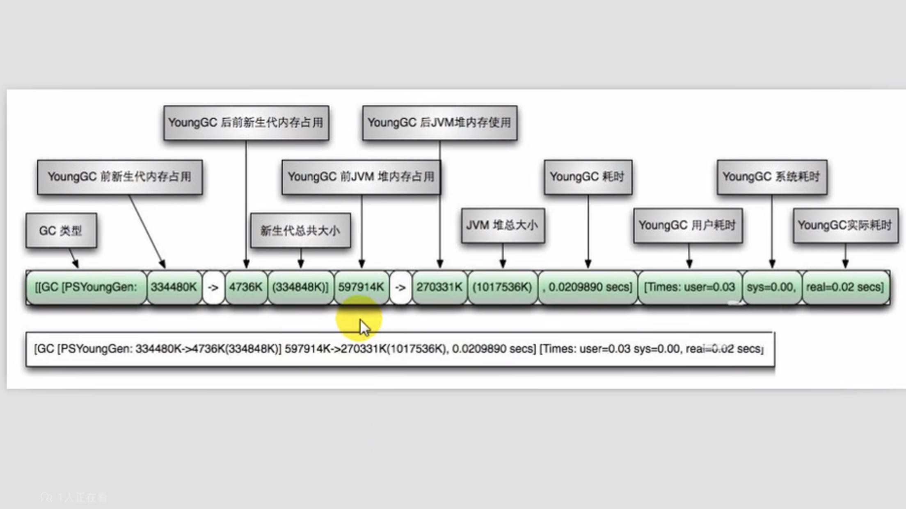
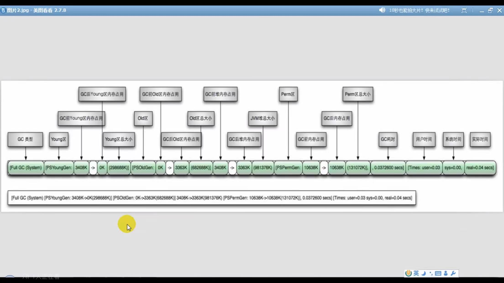

# 13 垃圾回收器 

1. GC分类与性能指标
2. 不同的垃圾回收器概述
3. Serial回收器：串行回收
4. ParNew回收：并行回收
5. Paralle回收：吞吐量优先
6. CMS回收器：低延迟
7. G1回收器：区域化分代式
8. 垃圾回收器总结
9. GC日志分析
10. 垃圾回收器的新发展

## 1 GC分类与性能指标

* 分类

  * 按线程数：并行、串行
    * 串行默认被应用于客户端Client模式下使用
  * 按工作模式：并发式、独占式
    * 并发：垃圾回收与应用程序交替执行
  * 按碎片处理方式：压缩式、非压缩式
    * 压缩：指针碰撞
    * 非压缩式：空闲列表
  * 按工作区间：年轻代、老年代

* 性能指标

  * 吞吐量：运行用户代码的时间占总运行时间的比例

  * 暂停时间：执行垃圾收集时，程序的工作线程被暂停的时间

  * 内存占用：Java堆区所占的内存大小

  * 收集频率：相对于应用程序的执行，收集操作发生的频率

  * 垃圾收集开销

  * 快速：一个对象从诞生到被回收所经历的时间

  * 重点关注： 吞吐量、暂停时间

    在最大吞吐量优先的情况下，降低停顿时间

## 2不同的垃圾回收器概述

> Java常见的垃圾收集器有哪些？

* 1999 jdk1.3.1 串行SerialGC，第一款GC。ParNew是SerialGC的并行版本

* 2022.2.26 Parallel Gc、Concurrent Mark Sweep GC（CMS） 随jdk1.4.2一起发布

* Parallel GC 在JDK6之后成为HotSpot默认GC

* 2012  jdk1.7   G1可用 （新生代、老年化）

* 2017 jdk9 G1为默认垃圾收集器，以替代CMS

* 2018年3月  jdk10 G1 垃圾回收器的并行完成垃圾回收，实现并行 来改善最坏情况下的延迟

  ****

* 2018年9月 jdk11 引入Epsilon垃圾回收器，又被称为“No-Op”（无操作）回收器。同时引入ZGC，可伸缩的低延迟垃圾回收器（Experimental，实验性)

* 2019年3月，JDK12发布，增强G1，自动返回未用堆内存给操作系统。同时，引入Shenandoah Gc：低停顿时间的GC（Experimental，实验性)

* 2019年9月 JDK13发布。增强ZGC，自动返回未用堆内存给操作系统

* 2020年3月 JDK14发布。删除CMS垃圾回收器，扩展ZGC在MacOS和Windows上的应用

**7款经典的垃圾收集器**

​	串行回收器：Serial、Serial Old

​	并行回收器：Parnew、Parallel Scavenge、Parallel Old

​	并发回收器：CMS、G1

新生代收集器:  Serial GC  Parallel Scavenge、ParNew GC

老年代收集器: Serial Old、Parallel Old、CMS

整堆： G1

* 如何查看使用的垃圾回收器
  * -XX:+PrintCommandLineFlags
  * jinfo -flag  UseG1GC/UseParallelGC pid
  * JDK6之后默认Parallel GC
  * JDK9后默认G1

## 3 Serial回收器-串行回收

+XX:+UserSerialGC 新生代用不用 Serial GC,老年代使用Serial Old GC

* 优势: 简单高效，尤其单CPU时，减少CPU切换消耗
* 目前较少使用，在多核CPU时，效率不高

## 4 ParNew回收器-并行回收

-XX:+UseParNewGC 指定ParNew GC

-XX:ParallelGCThreads 限制线程数量，默认开启和CPU核数相同的线程数

## 5 Parallel Scavenge回收器-吞吐量优先

回收新生代，复制算法、并行回收、STW

Parallel Old 标记-压缩

可控制吞吐量、吞吐量优先，适合在后台运算、不需要太多交互的任务

* 场景：批量处理、订单处理、工资支付、科学计算
* jdk1.6 替换Serial Old GC做为老年代GC
* -XX:+UseParallelGC  -XX:+UseParallelOldGC
  * 开启一个，另一个也会开启
* -XX:ParallelGCThreads 限制线程数量，默认开启和CPU核数相同的线程数
* -XX:MaxGCPauseMills 垃圾收集器最大停顿时间
* -XX:GCTimeRatio 垃圾收集时间占总时间的比例(0,100) 默认99，即垃圾回收不超过1%

## 6 CMS回收器-低延迟

JDK1.5 推出 Concurrent-Mark-Sweep  标记清除，垃圾回收线程也用户线程同时工作

* 初始标记：STW，标记GC Roots能直接关联到的对象，速度非常快
* 并发标记(Conrurrent-Mark)：从GC Roots直接关联对象开始遍历整个对象图的对过，耗时较长但不需STW。
* 重新标记(Remark)阶段：修改并发标记期间，因程序运行产生变动的部分对象进行标记记录。
* 并发清除(concurrent-Sweep)：清理标记阶段判断已经死亡的对象，释放空间。**存放碎片**

****

* 优点：
  * 并发收集
  * 低延迟
* 弊端：
  * 产生内存碎片
  * CMS收集器CPU资源非常敏感
  * CMS收集器无法处理浮动垃圾
* 参数：
  * -XX:+UseConcMarkSweepGC 指定使用CMS GC （老年代）
    * 开启后自动启动-XX:UseParNewGC，指定新生代GC
  * -XX:CMSlnitiatingOccupanyFraction 设置堆内存使用率的阈值
  * -XX:+UseCMSCompactAtFullCollection 指定Full GC 进行压缩整理，避免碎片
  * -XX:CMSFullGCsBeforeCompaction 设置执行多少次Full GC后对内在空间进行压缩
  * -XX:ParalleCMSThreads 设置CMS的线程数量
* 小结
  * 最小化使用内在和并行开销：Serial GC
  * 最大化程序的吞吐量： Parllel GC
  * 最小化GC中断或停顿时间： CMS GC   (ParNew GC 做新生代)
  * JDK9  CMS 标识为Deprecate

## 7 G1回收器-区域化分代式

G1: Garbage First   -XX:+UseG1GC 

延迟可控的情况下，获得尽可能高的吞吐量，全功能收集器

* 并行与并发
  * 并行性：G1在回收期间，多个GC线程同时工作
  * 并发性：G1拥有与应用程序交替执行能力，部分工作可以和应用程序交替执行
* 分代收集
  * 区分年轻代、老年代
* 空间整合
* 可预测的停顿时间模型

* 参数
  * -XX:+UseG1GC
  * -XX:G1HeapRegionSize 设置每个Region的大小，值是2的幂，范围1MB-32MB，默认是堆内存1/2000
  * -XX:MaxGCPauseMills 期望达到的最大GC停顿时间指标（但不保证达到），默认200ms
  * -XX:ParallelGCThread STW工作线程数，最多8
  * -XX:ConcGCThreads  并发标记的线程数，设置为并行 垃圾回收纯种的1/4左右
  * -XX:InitiatingHeapOccupancyPercent 触发并发GC周期的Java堆占用率阈值，默认45% ？？？

* 场景：
  * 面向服务端，大内存、多处理器
  * 最主要的应用是低GC延迟，
  * 如堆大小6GB或更大时，可预测的暂停时间可以低于0.5s
  * 用来替换JDK1.5中的CMS收集器
* 分区Region 化整为零
  * H 堆中大对象，默认直接会被分配到老年代，如果是一个短期存在的大对象，就会对垃圾收集造成影响。G1划分了Humongous区存储。
* G1回收过程
  * 年轻代GC （Young GC)
    * RSet
  * 老年代并发过程（Concurrent Marking)
  * 混合回收（Mixed GC)

## 8 7种经典垃圾回收器总结

Serial => Parallel => CMS => G1 => ZGC

## 9 如何选择垃圾回收器

* 优先调整堆的大小让JVM自适应完成

* 如果内存小于100M，使用串行收集器

* 如果是单核、单机程序、没有停顿时间要求，串行

* 如果是多CPU、需要吞吐量、允许停顿时间超过1S，选择并行或者JVM自已选择

* 如果是多CPU、所示低停顿时间，需要快速响应（比如延迟不能超过1S，如互联网应用）使用并行收集器

  官方推荐G1

  没有最好的收集器，更没有万能的收集器

  调优永远是针对特定场景、特定需求，不存在一劳永逸的收集器

## 10 GC日志 

* 参数
  * -XX:+PrintGC    输出GC日志，类似：-verbose:gc
  * -XX:+PrintGCDetails 转出GC详细日志
  * -XX:+PrintGCTimeStamps  输出GC的时间戳(以基准时间的形式)
    * JDK11后：-Xlog:gc::utctime -XX:NativeMemoryTracking=summary
  * -XX:+PrintGCDateStamps 输出GC的时间戳(以日期的形式，如：2022-11-28T13:01:03.123+0800)
  * -XX:PrintHeapAtGC  在进行GC的前后打印出堆的信息
  * -Xloggc:../logs/gc.log   日志文件输出路径

* Young GC

* Full GC

