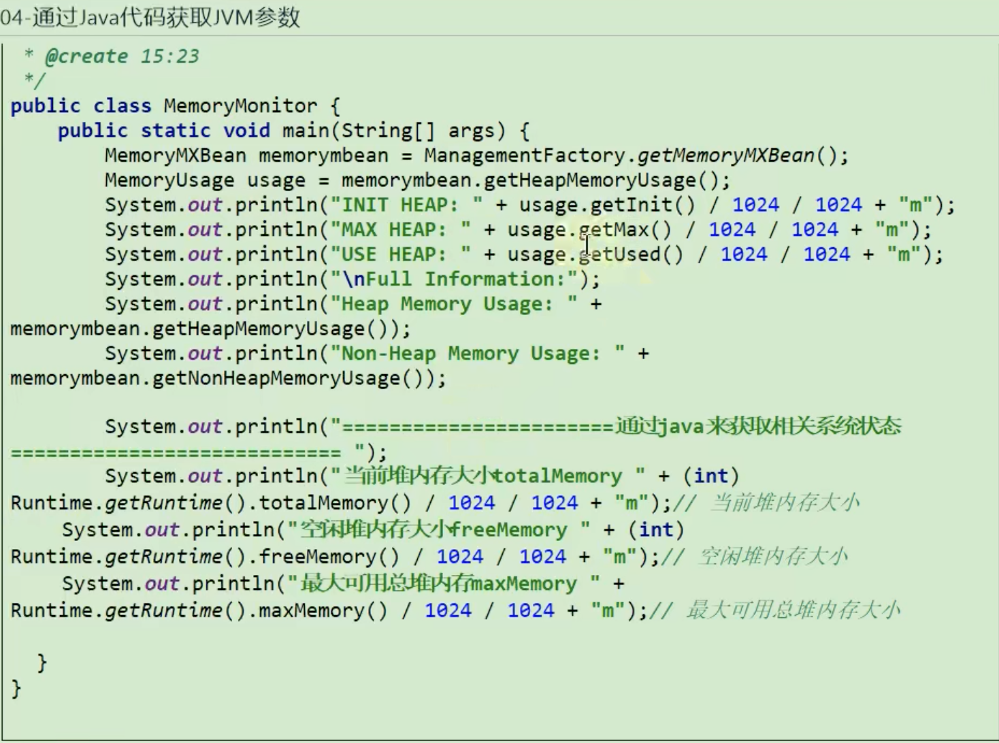

# 33 JVM参数选项类型

### 类型一：标准参数选项

比较稳定，后续版本基本不会变化

以`-`开关

运行`java`/`java -help`查看所有选项

### 类型二：-X参数选项

非标准化参数，功能比较稳定，但官方后续版本可能会变更

以`-X`开关

运行`java -X`命令可以看到所有的X选项

### 类型三：-XX参数选项

非标准化参数

使用最多的参数类型

这类选项属于实验性，不稳定

以`-XX`开头

* 作用：用于开发和调试JVM

## 打印参数

* java -XX:+PrintFlagInitial 查看所有JVM参数启动的初始值
* java -XX:+PrintFlagsFinal 查看所有JVM参数的最终值

## 常用JVM参数选项设置

### 堆、栈、方法区

* 栈 `-Xss128k`

  * 等价于 `-XX:+ThreadStackSize=128k`

* 堆

  * `-Xms512m` 等价于 `-XX:InitialHeapSize=512m`
  * `-Xmx512m` 等价于 `-XX:MaxHeapSize=512m`   
  * `-Xmn128m` 等价于 `-XX:InitialHeapSize=512m`  年轻代
    * 官方推荐设置为整个堆的2/3

  * `-XX:NewSize=1024m` 设置年轻代初始值 
  * `-XX:MaxNewSize=1024m` 设置年轻代最大值
  * `-XX:SurviorRation=8 ` 设置年轻代中Eden我与一个Surivor区的比值，默认为8
    * 真实情况会开启`-XX:+UseAdaptiveSizePolicy`，出现6:1:1情况，而非8:1:1
  * `-XX:+UseAdaptiveSizePolicy` 自动选择各区大小比例
  * `-XX:NewRation=4` 设置老年代与年轻代（包括一个Eden和2个Survivor区）的比值
  * `-XX:PretenureSizeThreadhold=1024` 设置让大于此阈值的对象直接分配至老年代，单位字节
    * 只对Serial、ParNew收集器生效
  * `-XX:MaxTenuringThreshold=15`默认值 15，新生代每次GC后，还存活的对象年龄+1，当对象年龄大于该值，进入老年代
  * `-XX:+PrintTenuringDistribution` 让JVM在每次MinorGC后打印出当前使用的Surivor中对象的年龄分布
  * `-XX:TargetSurvivorRation` 表示MinorGC结束后Survivor区域中占用空间的期望比例

* 方法区

  * 永久代
    * -XX:PermSize=256m
    * -XX:MaxPermSize=256m
  * 元空间（JDK1.8及后）
    * `-XX:MetaspaceSize`初始空间大小
    * `-XX:MaxMetaspaceSize` 最在空间、默认没有限制
    * `-XX:+UseCompressedOops`压缩对象指针
    * `-XX+UseCompressedClassPointers`压缩类指针
    * `-XX:CompressedClassSpaceSize`设置class metaspace的大小，默认1g

* 直接内存

  * `-XX:MaxDirectMemorySize`指定DirectMemory容量，若未指定，则默认与Java堆最大值一样

### OutOfMemory相关选项

* `-XX:+HeapDumpOnOutOfMemoryError`
* `-XX:+HeapDumpBeforeFullGC`
* `-XX:HeapDumpPath=<path>`
* `-XX:OnOutOfMemoryError`指定一个可行性程序或者脚本的路径，当发生OOM时，执行此脚本

### 垃圾回收器相关选项

* 垃圾收集器组合关系

### GC日志相关选项

* `-XX:+PrintGC`    输出GC日志，类似：-verbose:gc
* `-XX:+PrintGCDetails` 转出GC详细日志
* `-XX:+PrintGCTimeStamps`  输出GC的时间戳(以基准时间的形式)
  * JDK11后：`-Xlog:gc::utctime -XX:NativeMemoryTracking=summary`
* `-XX:+PrintGCDateStamps` 输出GC的时间戳(以日期的形式，如：2022-11-28T13:01:03.123+0800)
* `-XX:PrintHeapAtGC`  在进行GC的前后打印出堆的信息
* `-Xloggc:../logs/gc.log`   日志文件输出路径

### 通过java代码获取JVM参数

